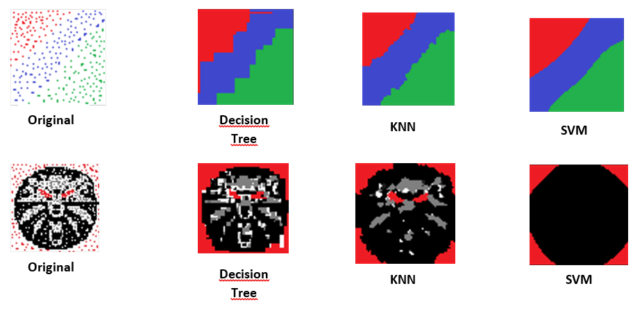

# MachineLearningProject-ImageProcessing

**Univesity Project**

Using the given coordinates and color of a set of pixels from 2 custom generated images (linear &amp; non-linear separabil), I'm gonna predict, using 3 supervised learning classifiers (DecisionTree, SVM, KNN), the color of any given pixel.

